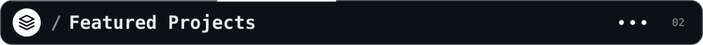
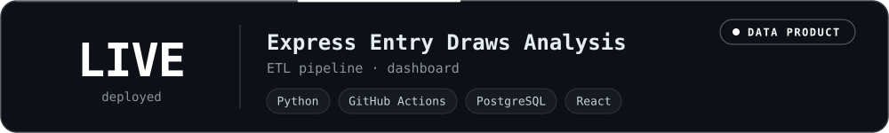
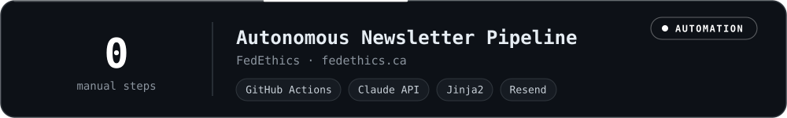
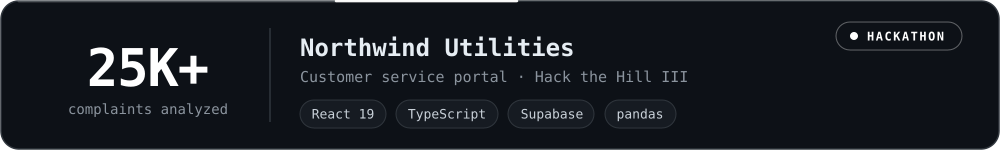
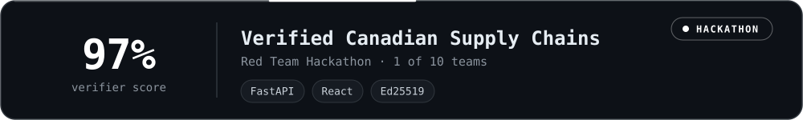
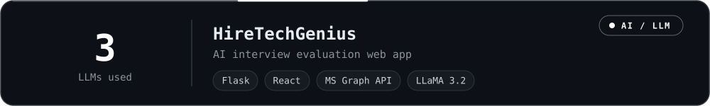

<!-- ACCENT COLOR: ffffff — find and replace across README.md and assets/ to recolor the whole profile -->

  
    
  
  
  
  

I'm a mechatronics engineer who builds autonomous systems. I spot manual, tangled processes, model how they work, and build software that runs them on its own, from SCADA on the factory floor to AI/ML pipelines and full-stack apps. I work under the **BitToByte** brand.

 <b>Based in:</b> Ottawa-Gatineau, Canada 
 <b>I use daily:</b> <code>python</code> <code>sql</code> <code>react</code> <code>typescript</code> <code>github actions</code> 
 <b>Currently working on:</b> AI-driven data pipelines (an automated newsletter engine using the Claude API) and my BitToByte portfolio ecosystem 
 <b>Currently learning:</b> French and German, plus deeper ML with PyTorch and RAG systems 
 <b>Ask me about:</b> SCADA and industrial automation, RAG and LLM pipelines, data engineering, GA4 analytics 
 <b>Looking to collaborate on:</b> open-source AI automation and data pipelines (RAG, LLM workflows), civic-tech and data-for-good analytics, SCADA/IoT data tooling 
 <b>Looking for help with:</b> finding data, automation, or AI roles in the Ottawa-Gatineau area, and connecting with people in those fields 
 <b>Fun fact:</b> I've gone from co-managing a family restaurant to tuning e-bike controllers to building AI pipelines that write and send a newsletter with no human in the loop

A live data product that tracks and analyzes Express Entry draws. A Python ETL pipeline automated with GitHub Actions loads a PostgreSQL database, and a React dashboard turns the data into something anyone can explore. 
 <a href="https://expressentry.bittobyte.qzz.io">expressentry.bittobyte.qzz.io</a>

Part of the <a href="https://fedethics.ca">fedethics.ca</a> website. A daily GitHub Actions job scrapes and ranks articles, then every two weeks the Claude API selects the stories, writes the issue, and Resend sends it, with no manual step from ingestion to send. Also includes GA4/GTM tracking with Consent Mode v2. 
 <a href="https://fedethics.ca">fedethics.ca</a>

Hack the Hill III (CGI challenge). A shared case record for customers, employees, and managers, replacing four disconnected systems. Built with React 19, TypeScript, and Supabase/PostgreSQL, with role rules enforced in the database through Row-Level Security. Includes a pandas analysis of 25K+ complaints and a pitch deck built inside the app.

One of 10 teams selected nationally. A FastAPI + React prototype that verifies Made-in-Canada claims from Ed25519-signed supplier attestation chains and flags anomalies. The verifier scored 97% on a 1,000-row labeled test set.

A Flask + React app that evaluates interview transcripts with LLMs and generates PDF reports.

<table>
<tr>
<td align="center" width="50%">
  

 

 
<a href="https://www.postgresql.org/docs/current/sql.html">SQL</a>
</td>
<td align="center" width="50%">
  

 
<a href="https://keras.io">Keras</a> · <a href="https://huggingface.co">Hugging Face</a> · <a href="https://pandas.pydata.org">pandas</a> · <a href="https://numpy.org">NumPy</a> · <a href="https://matplotlib.org">Matplotlib</a> · <a href="https://powerbi.microsoft.com">Power BI</a> · <a href="https://www.tableau.com">Tableau</a>
</td>
</tr>
<tr>
<td align="center" width="50%">
  

 

 
<a href="https://streamlit.io">Streamlit</a> · <a href="https://jinja.palletsprojects.com">Jinja</a>
</td>
<td align="center" width="50%">
  

 

</td>
</tr>
</table>

  <a href="https://github.com/AlexMtzRmz0212">
  <picture>
    <source media="(prefers-color-scheme: dark)" srcset="https://raw.githubusercontent.com/AlexMtzRmz0212/AlexMtzRmz0212/output/github-snake-dark.svg" />
    <source media="(prefers-color-scheme: light)" srcset="https://raw.githubusercontent.com/AlexMtzRmz0212/AlexMtzRmz0212/output/github-snake.svg" />
    
  </picture>
  </a>

<table>
<tr>
<td align="center" width="50%">

</td>
<td align="center" width="50%">

</td>
</tr>
<tr>
<td align="center" width="50%">

</td>
<td align="center" width="50%">

</td>
</tr>
</table>

<b>Detailed metrics</b>

 

  

 

